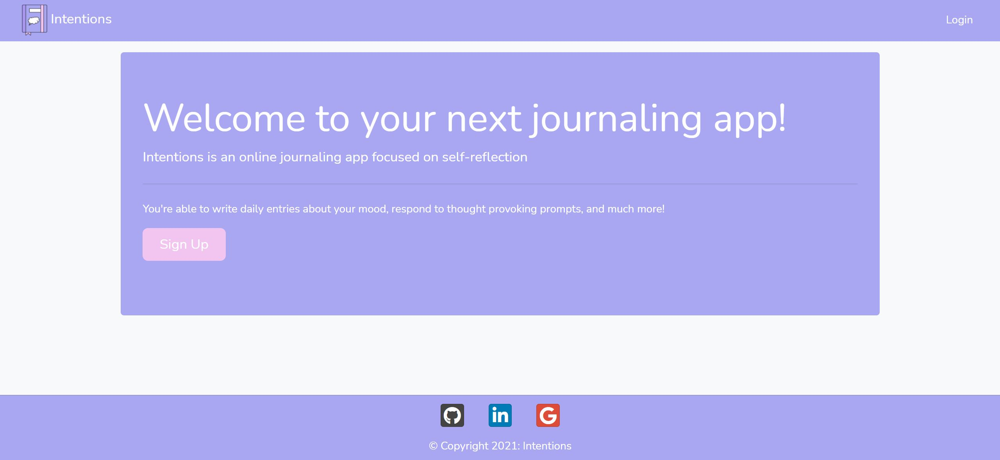
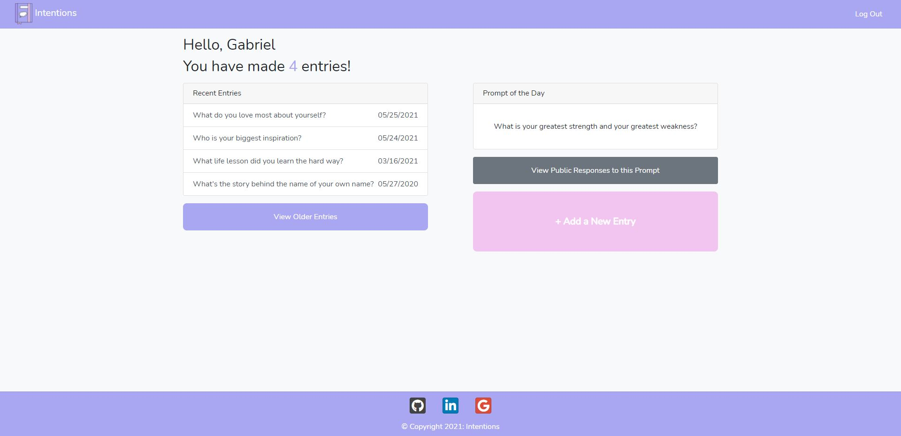
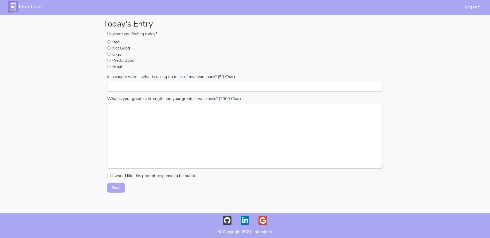
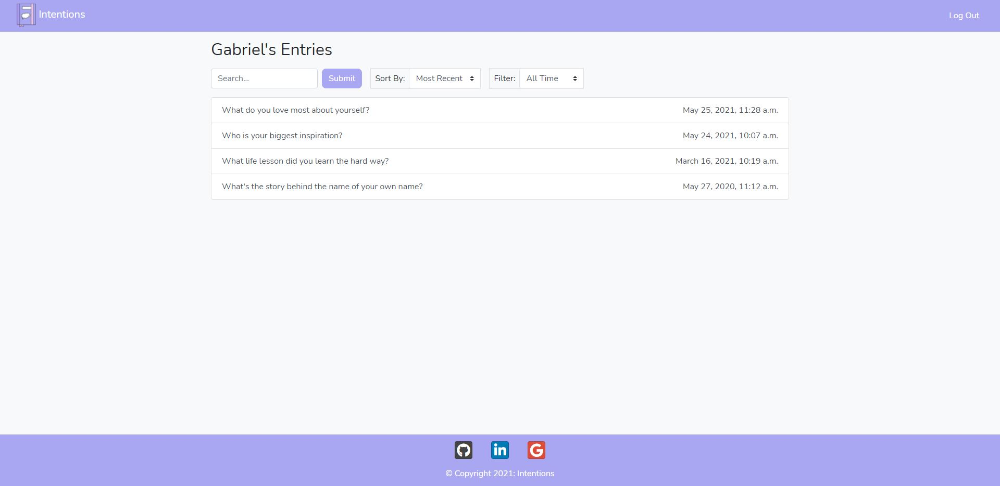
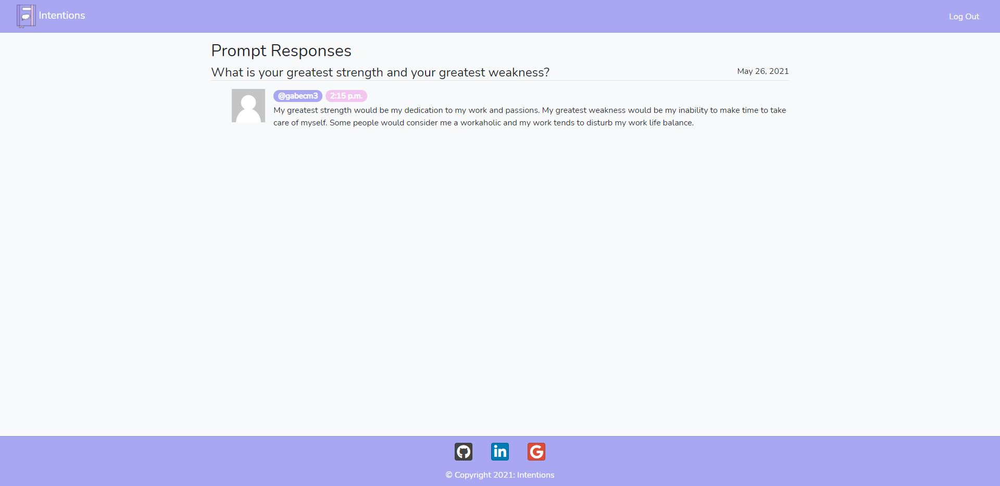

# Intentions
Intentions is an journaling web application focused on self-reflection
* Site URL: https://oit-intentions.herokuapp.com/
* Project Presentation Slides: https://docs.google.com/presentation/d/1hqIuTyE7rUaEJ1NrUCGhLq9nkwwHCNqYeYmhs4sbVRM/edit?usp=sharing
* Author: Gabriel Mallari

## Features
* Robust authentication features 
    * Sign Up Page
    * Login Page
    * Password Reset 
        * Uses Twilio Send Grid
* Dashboard
    * Displays a counter of the number of entries the user has made so far
    * Window that displays links to the 5 most recent entries
    * Window that displays the today's prompt (changes daily)
    * Contains buttons with links to other important pages in the app (entry archive, public responses, entry page, etc.)
* Entry Page
    * A form that asks questions about the user's mood and headspace
    * Allows users to respond to the prompt of the day
    * A checkbox that enables the user to make their prompt response public
        * Displays on the prompt response page
* Public Prompt Response Page
    * A view of all prompt responses the users allow to be public
    * Shows the most recently submitted responses first
    * Lists the user and submission time
* Entries Archive
    * Displays a list of all entries submitted by the user
    * User can search by keyword according to the prompt associated with the entry
    * User can sort the entries by most recent, date created, and alphabetical order
    * User can filter the entries by ones made this week, this month, and this year

## Screenshots

## License 
The BSD License

Copyright (c) 2021 HoosRooming

All rights reserved.

Redistribution and use in source and binary forms, with or without modification,
are permitted provided that the following conditions are met:

    1. Redistributions of source code must retain the above copyright notice,
       this list of conditions and the following disclaimer.

    2. Redistributions in binary form must reproduce the above copyright
       notice, this list of conditions and the following disclaimer in the
       documentation and/or other materials provided with the distribution.

    3. Neither the name of Django nor the names of its contributors may be used
       to endorse or promote products derived from this software without
       specific prior written permission.

THIS SOFTWARE IS PROVIDED BY THE COPYRIGHT HOLDERS AND CONTRIBUTORS "AS IS" AND
ANY EXPRESS OR IMPLIED WARRANTIES, INCLUDING, BUT NOT LIMITED TO, THE IMPLIED
WARRANTIES OF MERCHANTABILITY AND FITNESS FOR A PARTICULAR PURPOSE ARE
DISCLAIMED. IN NO EVENT SHALL THE COPYRIGHT OWNER OR CONTRIBUTORS BE LIABLE FOR
ANY DIRECT, INDIRECT, INCIDENTAL, SPECIAL, EXEMPLARY, OR CONSEQUENTIAL DAMAGES
(INCLUDING, BUT NOT LIMITED TO, PROCUREMENT OF SUBSTITUTE GOODS OR SERVICES;
LOSS OF USE, DATA, OR PROFITS; OR BUSINESS INTERRUPTION) HOWEVER CAUSED AND ON
ANY THEORY OF LIABILITY, WHETHER IN CONTRACT, STRICT LIABILITY, OR TORT
(INCLUDING NEGLIGENCE OR OTHERWISE) ARISING IN ANY WAY OUT OF THE USE OF THIS
SOFTWARE, EVEN IF ADVISED OF THE POSSIBILITY OF SUCH DAMAGE.